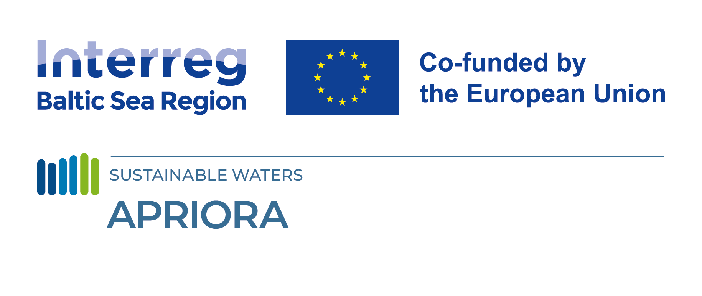

# APRIORA
In the project APRIORA, environmental protection agencies and wastewater treatment plants get equipped with a GIS-based risk assessment system to monitor and model concentrations of active pharmaceutical ingredients (APIs) in order to improve water management and reduce emissions. Here in this repository there is the code of the plugin. It contains several tools for different purposes: **flow estimation**, **emission loads**, **API accumulation** and **risk assessment**.

## Set of tools
### Hydro-Module
The purpose of this set of tools is to estimate mean flow and mean low flow at a river level.   
*1 - Fix river network*: it aligns the river network with the subcatchments' borders and calculates the contributing relationship between the different river sections.   
*2 - Flow estimation*: it estimates the flow for each subcatchment (subcatchment level) or for each river section (river level).  

### API emission
The purpose of this set of tools is to estimate load, concentration and perform risk assessment.   
*3 - Emission loads*: it gives the user the access to the APRIORA’s internal database related to consumption data and removal rates. Finally, it calculates the load of previously selected APIs at each WWTP within a catchment.   
*4 - Accumulation*: it calculates the accumulation and the concentration of the APIs load at each discharge point and at each river section.   
*5 - Risk assessment*: identifies the extent of risk assessment of each API by calculating environmental, human health, antimicrobial resistance and Component Cumulative Risk Index.   

## Documentation
A detailed manual is published on [ReadTheDocs](https://hosting-apriora-manual.readthedocs.io/en/latest/index.html)

## Development / Funding
If you have any suggestions for improvements feel free to write an issue or create a fork.
The plugin is being developed under the project [APRIORA](https://interreg-baltic.eu/project/apriora/). This project is funded by the Interreg Baltic Sea Region
Programme. Co-founded by the European Union (ERDF), this #MadeWithInterreg project helps to remove pollutants from our waters.

## Credits
This plugin incorporates logic and code adapted from the **WaterNetAnalyzer** plugin, originally developed by **Jannik Schilling**.
Specifically, the functions for tool 1, 2, and 4 are the ones containing such methods.

* Publication: [Schilling J., Tranckner J. (2020) Estimation of Wastewater Discharges by Means of OpenStreetMap Data, Water, 12 (3)](https://doi.org/10.3390/w12030628)
* [GitHub repository](https://github.com/Jannik-Schilling/WaterNetAnalyzer)
* Copyright (C) 2020 by Jannik Schilling
* License: GNU General Public License v2

## License
This project is licensed under the GPLv2 License; see the [LICENSE.rst](LICENSE.rst) file for details
