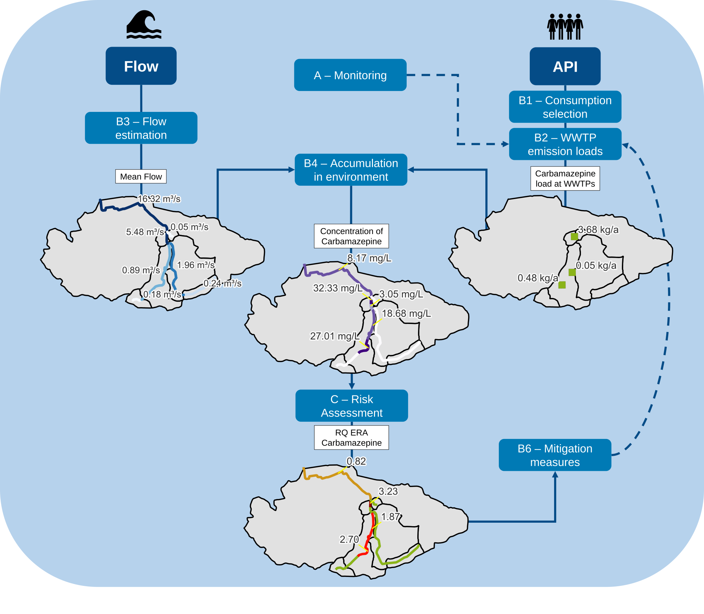

.. _Introduction:

Introduction
============
The *APRIORA* plugin is a QGIS tool divided in two groups:

* :ref:`Hydro_Module`
* :ref:`API_Emission`

The first group of tools is designed to estimate flow in normal and low condition in a catchment, while the
second one calculate concentration of different Active Pharmaceutical Ingredients (APIs) and perform the 
risk assessment in each river section. A scheme of the plugin is illustrated in :numref:`scheme-fig`.

.. _scheme-fig:

    
    Scheme of the APRIORA plugin.

For more information, check the `project website <https://interreg-baltic.eu/project/apriora/>`_.

Getting Started
---------------
Please find instructions on how to install the plugin in the :ref:`Installation` section.

Support, contributing and testing
---------------------------------
Please contribute using `Github <https://github.com/cridrive66/APRIORA>`_. Create a branch, add commits and *open a pull request*.

Reporting bugs or suggesting improvements
-----------------------------------------
If you find a bug in the APRIORA plugin, please open a `new issue <https://github.com/cridrive66/APRIORA/issues>`_ and tag it "bug".
If you want to suggest a new feature or an improvement of a current feature, please open a new issue and tag it "improvement".
For both cases, you can always send an email to cristiano.guidi2@uni-rostock.de.

Latest changhes
---------------
This section contains the most recent changes and updates to the plugin. More detailed description can be found on the
`Github release page <https://github.com/cridrive66/APRIORA/releases>`_.

*   v.1.2.0: fixed error in "subcatchment_level.shp" of "Flow Estimation" tool. Tool 2-3-4 are now merged in one tool.
    Tool 5 and 6 are also merged in one tool. "PNEC" window moved to "Risk assessment" tool. New filter function 
    available for consumption dataset in Tool 3.
*   v.1.1.0: dilution ration formula changed and now calculated for each river section. Risk Assessment final output has now 
    the style of one of the risk categories selected (ERA, HHRA or AMR-RA)
*   v.1.0.1: updated medatata.txt file and consumption values for Sweden
*   v.1.0.0: official release on the QGIS repository. Changed interface of *5 - API parameter selection*; implemented HHRA and AMR-RA in
    *8 - Risk Assessment*; name changed of "Flow Estimation" group to "Hydro-Module"; tool 1: ungauged_subcatchments is now an output of
    this tool instead of tool 2; tool 5: "Custom table" window changed name to "WWTP location"; tool 6: users can now include "WWTP effluent"
    data in order to calculate dilution ratio in tool 7; tool 8: logistic function removed. New function defined to calculate CCRI.
*   v.0.7.2: *7 - Accumulation* is now compatible with polygon river networks. In the previous versions it was necessary to 
    provide the river network as a multi-line shapefile. In the Finnish catchment with the Vemala model this caused some issues
    since the output of the hydrological model is a polygon shapefile. Because of this reason, the tool was adapted to accept 
    polygon shapefile of the river network as input. Additionally, *8 - Risk Assessment* is now compatible with polygon river 
    networks too.
*   v.0.7.1: *5 - API parameter selection* is moved from the menu toolbar to the processing toolbox like the other 7 tools. The 
    output of monitoring point from *7 - Accumulation* now contains also the accumulated load of APIs and not just the concentration
    values. The river layer output from *8 - Risk Assessment* now contains the NET_ID column for each river section. This addition
    makes easier to identify the river sections at risk.
*   v.0.7.0: in *7 - Accumulation* is not necessary anymore to provide "mean flow" and "mean low flow" values for the individual 
    section, but only the accumulated value.
*   v.0.6.9: Fixed error in *6 - Emission Loads*. When a new value was added in *5 - API parameter selection*, 
    algorithm had problems retrieving the new value and was referring to the original one. Now fixed.
* v.0.6.8: Added function in *7 - Accumulation* to calculate concentration of APIs at monitoring stations. 
* v.0.6.7: Accumulation function was not correctly distribute the flow to upstream and downstream sections after the split. The function was ordering the sections by river lengths. Problem fixed by ordering the sections by their NET_ID.
* v.0.6.6: *Consumption Selection* tool changed name to *5 - API parameter selection*. Added description to API emission tools.
* v.0.6.5: update Consumption and Removal Rate dataset. Fixed some typos. Added compatibility for GEOS version < 3.10.
* v.0.6.4: Fixed error: Feature (3) from “subcatchment_layer_copy” has invalid geometry.
* v.0.6.3: Fixed error: object has no attribute 'parameterAsStrings'.
* v.0.6.2: Fixed typo in *Consumption Selection* tool.
* v.0.6.1: Fixed connection between PNEC custom table and *Risk assessment* tool.
* v.0.6: *Risk assessment* tool added to the set of available tools.
* v.0.5.1: Added feature to customize input data of *Consumption selection*.
* v.0.5: *Accumulation* tool developed.
* v.0.4: *API Emission* set of tools is created. *Consumption selection* and *Emission Loads* developed.
* v.0.3: Adaptation for transferability of *Contributing area of gauging station*, *Calculate geofactors*, *Flow estimation* to the new algorithm developed in v.0.3
* v.0.2: *Fix River Network* is developed for transferability of *Flow estimation* in different catchments.
* v.0.1: *Flow estimation* set of tools developed (*Contributing area of gauging station*, *Calculate geofactors*, *Flow estimation*), but working only for the German case study (Warnow).