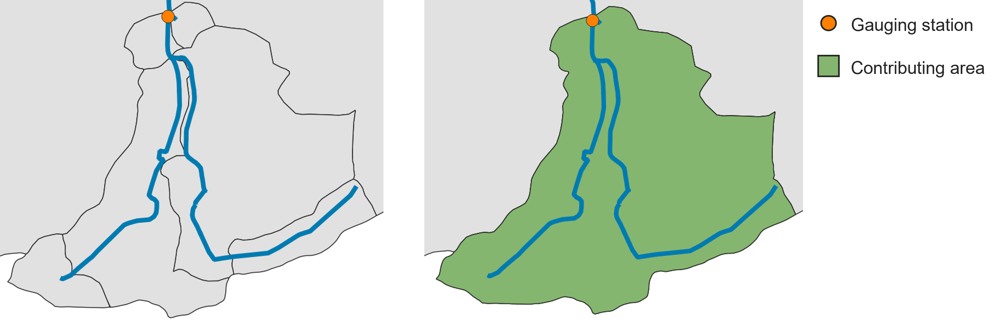
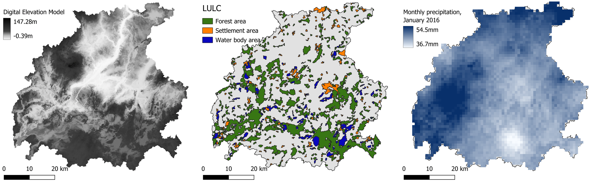
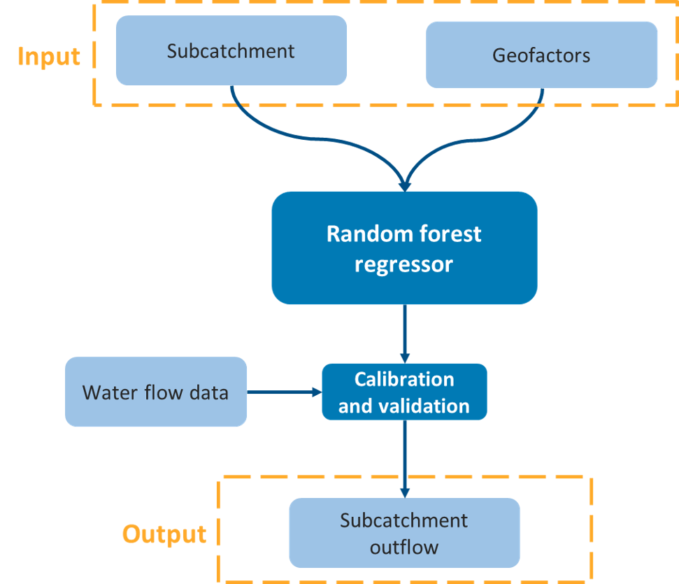

.. _flow-estimation-tool:

Flow Estimation
===============

This tool represents the second step of the hydrological workflow, where the actual flow values are estimated. The flow estimation is based on a machine-learning method known as 
Random Forest (`source <https://scikit-learn.org/stable/modules/generated/sklearn.ensemble.RandomForestRegressor.html>`_). 

This step is performed all at once, but three different processes are happening in the tool:

* :ref:`Contributing_Area`
* :ref:`Calculate_Geofactors`
* :ref:`Flow_Estimation`

.. _Contributing_Area:

Contributing Area of Gauging Station
------------------------------------

A gauging station measures the flow of a river. However, to understand the flow dynamics, we need to determine the basin area contributing to each gauging station.
This function allows us to calculate the area upstream each gauging station, which it is used as input in the next process (:numref:`contr_area-fig`).

.. _contr_area-fig:

    
    On the left: a group of subcatchments with a gauging station. On the right: the contributing area of the gauging station (in green) calculated by the tool.

The gauging station shapefile should be a point shapefile representing the gauging stations within the catchment. Beside the basic information 
(like ID, coordinates, etc.), it should contain two columns related to *Mean Flow* and *Mean Low Flow*. The two average values should be calculated over a 
certain time series (e.g., 1991 - 2020).
In :numref:`gaug_station_example` , you can see an example of the attribute table of **gauging_stations.shp**.

.. _gaug_station_example:

.. list-table:: Example of attribute table of gauging stations.
    :header-rows: 1
    :widths: 25 30 20 20

    * - gml_id
      - Name
      - Mean Flow
      - Mean Low Flow
    * - ID_1974116
      - Ahrenshagen
      - 1.15200
      - 0.2857
    * - ID_1974265
      - Bützow Gesamt
      - 7.89810
      - 1.72140
    * - ID_1974124
      - Güstrow
      - 3.18780
      - 0.6122
    * - ID_1974292
      - Rostock-Geinitzbrücke
      - 16.00440
      - 2.86670
    * - ID_1974127
      - Wolken
      - 4.64300
      - 0.8783

.. _Calculate_Geofactors:

Calculate Geofactors
--------------------

The flow estimation model uses a machine-learning (ML) approach to predict water flow in each subcatchment. At the core of this method is a regionalization
process that builds a predictive relationship between model parameters and the physical and hydrological characteristics -referred as *geofactors*- of the
subcatchments. These geofactors include properties such as area, slope, land use and other attributes known to influence hydrological behavior.

Once this relationship is established, it can be applied to ungauged subcatchments, allowing the model to estimate their parameters and simulate water flow
even in the absence of direct measurements. The tool automatically derives the necessary geofactors from the provided input datasets, guaranteeing consistent
and data-driven parameter prediction across all subcatchments.
The input data that are used to calculate the geofactors are:

* digital elevation model
* land use land cover map data (particularly water bodies, forest and settlement area)
* precipitation data (a time serie equal to the time serie used for the flow at the gauging stations)

An example representing these input data related to the Warnow catchment (Germany) can be found in :numref:`geofactors_example-fig`.

.. _geofactors_example-fig:

    
    From left to right: DEM, LULC and precipitation data for the Warnow catchment (Germany).

In :numref:`input_data_example` it is shown an example of possible sources where the necessary data can be found. For the ERA5 precipitation dataset,
"Monthly averaged reanalysis" should be selected as *Product type*, "Total precipitation" as *Variable* and "NetCDF4" as *Data format*.

.. _input_data_example:

.. list-table:: Example of input data sources
   :header-rows: 1
   :widths: 3 3 4

   * - Input data
     - Format
     - Source
   * - DEM
     - Raster (.tif)
     - `Copernicus GLO-30 <https://portal.opentopography.org/raster?opentopoID=OTSDEM.032021.4326.3>`_
   * - Water area
     - Shapefile (.shp)
     - `CORINE Land Cover 2018 <https://land.copernicus.eu/en/products/corine-land-cover/clc2018#download>`_
   * - Forest area
     - Shapefile (.shp)
     - `CORINE Land Cover 2018 <https://land.copernicus.eu/en/products/corine-land-cover/clc2018#download>`_
   * - Settlement area
     - Shapefile (.shp)
     - `CORINE Land Cover 2018 <https://land.copernicus.eu/en/products/corine-land-cover/clc2018#download>`_
   * - Precipitation data
     - NetCDF (.nc)
     - `ERA 5 Total precipitation <https://cds.climate.copernicus.eu/datasets/reanalysis-era5-single-levels-monthly-means?tab=download>`_

.. _Flow_Estimation:

Flow Estimation via Random Forest
---------------------------------

In this step, the tool combines the outputs generated by :ref:`Fix_River` and :ref:`Calculate_Geofactors`. Using these inputs, the model is trained and validated on 
gauged subcatchments, allowing it to learn the relationship between geofactors and flow characteristics. Once trained, the model is applied to ungauged subcatchments
to predict their flow behavior.

The resulting outputs include **annual mean flow** and **annual mean low flow**, calculated for each subcatchment or along the river network, depending on the 
selected configuration. :numref:`flow_estimation_scheme-fig` shows a simplified scheme of the model flow.

.. _flow_estimation_scheme-fig:

    
    Simplified scheme of flow estimation process.

Input data
----------

* **ungauged_subcatch_geofactors.shp** (from :ref:`Fix_River`)
* **fixed_river_network.shp** (from :ref:`Fix_River`)
* **gauging_stations.shp** (see :ref:`Contributing_Area`)
* **DEM.tif** (see :ref:`Calculate_Geofactors`)
* **water_area.shp** (see :ref:`Calculate_Geofactors`)
* **forest_area.shp** (see :ref:`Calculate_Geofactors`)
* **settlement_area.shp** (see :ref:`Calculate_Geofactors`)
* **precipitation data** (see :ref:`Calculate_Geofactors`)

Workflow
--------

1. Go in the Processing Toolbox and look for the *APRIORA* plugin. Click on *Hydro-Module* and open *2 - Flow Estimation*
2. Choose **ungauged_subcatchments.shp** as input for *Ungauged subcatchments*
3. Choose **fixed_river_network.shp** as input for *Fixed river network*
4. Choose **gauging_stations.shp** as input for *Gauging stations*
5. Select the *Mean Flow* field and *Mean Low Flow* field from **gauging_stations.shp**
6. Choose **DEM.tif** as input for *Digital surface model*
7. Choose **water_area.shp** as input for *Water area*
8. Choose **forest_area.shp** as input for *Forest area*
9. Choose **settlement_area.shp** as input for *Settlement area*
10. Select the **precipitation data** folder containing your NetCDF (.nc) data. The tool accepts multiple files 
    (one .nc file per year) or single file (one aggregated .nc file containing the full time series). Then tick the box accordingly (e.g., if the 
    precipitation file has been downloaded from ERA5, tick this box)
11. Select which is the driest month in the catchment (default value: August)
12. Select your preferred option for *Model parameter estimation source*. If your catchment has no or few gauging stations, a pre-trained model
    for different regions can be used. Alternatively, you can estimate the paramteres from the gauging stations data previously provided.
13. Click on *Run*

.. raw:: html

  <figure>
    <iframe 
      width="700"
      height="370"
      src="https://www.youtube.com/embed/TWoHbuRqP-Y"
      title="Workflow of the Flow Estimation tool."
      allow="picture-in-picture"
      allowfullscreen>
    </iframe>
    <figcaption>Video: Workflow of the <i>Flow Estimation</i> tool.</figcaption>
  </figure>

Output data:

* **subcatchment_level.shp**
* **river_level.shp**
* **gauged_subcatch_geofactors.shp** [optional]
* **ungauged_subcatch_geofactors.shp** [optional]

The tool generates two output including estimated flow: one at the subcatchment level and one at the river-section level. Both contain a similar set of
attributes. The newly added flow-related fields are displayed in :numref:`output_data_flow`.

.. _output_data_flow:

.. list-table:: New flow-related fields added to output. 
   :header-rows: 1
   :width: 100%
   :widths: 20 60 20

   * - Column ID
     - Description
     - Unit
   * - Mean_Flow
     - Estimated annual mean flow for the individual river section or subcatchment
     - m³/s
   * - M_Low_Flow
     - Estimated annual mean low flow for the individual river section or subcatchment
     - m³/s
   * - acc_Mean
     - Accumulated mean flow, representing the total upstream contribution of mean flow up to the given river section 
     - m³/s
   * - acc_M_Low
     - Accumulated mean low flow, representing the total upstream contribution of mean low flow up to the given river section
     - m³/s     

These outputs can be used for regional water balance assessments, hydrological model initialization, environmental flow studies and downstream analysis
requiring spatially distributed flow estimates.

Additionally, two optional output can be generated. Open the attribute table of **gauged_subcatch_geofactors.shp** and check its features. Each feature represents the
contributing area for a gauging station. If there is more than one gauging station, you will notice that the contributing areas might be overlapping. If you want
to highlight a specific feature, right-click on it and select *Flash Feature*. Important to notice: there are two extra fields called *Mean_Flow* and 
*M_Low_Flow* that were directly transferred from **gauging_stations.shp**. The other fields are also present in **ungauged_subcatch_geofactors.shp** and 
:numref:`output_data` explains what each field represents.

.. _output_data:

.. list-table:: Attribute table of the output of "Calculate Geofactors".
   :header-rows: 1
   :width: 100%
   :widths: 10 20 60 10

   * - Column ID
     - Full name
     - Description
     - Unit
   * - Mean_Flow [#f1]_
     - Mean flow
     - Average standard flow calculated for a certain time series at the gauging station
     - m³/s
   * - M_Low_Flow [#f1]_
     - Mean Low Flow
     - Average low flow calculated for a certain time series at the gauging station
     - m³/s
   * - H_mean
     - Average height
     - Average height within the subcatchment 
     - m
   * - H_stdev
     - Minimum height
     - Minimum height within the subcatchment
     - m
   * - H_min
     - Standard deviation of the height
     - Standard deviation of the height within the subcatchment
     - m
   * - AREA_SC
     - Area of the subcatchment
     - Area of the subcatchment
     - km²
   * - PERIM_SC
     - Perimeter of the subcatchment
     - Perimeter of the subcatchment
     - km
   * - SHAPE_SC
     - Shape of the subcatchment
     - Add formula somewhere
     - [-]
   * - Slp_mean
     - Average slope
     - Average slope within the subcatchment
     - %
   * - Slp_stdev
     - Standard deviation of the slope
     - Standard deviation of the slope within the subcatchment
     - %
   * - RivNetDens
     - River network density
     - sum of the river network's lenght within the subcatchment divided by the area of the subcatchment
     - km/km²
   * - PropWatAr
     - Proportion of water area
     - (Area of water bodies divided by the area of the subcatchment)*100
     - %
   * - Forest %
     - Forest share
     - (Area of forest divided by the area of the subcatchment)*100
     - %
   * - Settl %
     - Settlement share
     - (Area of settlement divided by the area of the subcatchment)*100
     - %
   * - PrecYearly
     - Yearly precipitation
     - Average yearly precipitation
     - mm
   * - PrecDry
     - Dry month precipitation
     - Average precipitation during the dry month
     - mm

    
.. [#f1] Present only in **gauged_subcatch_geofactors.shp**