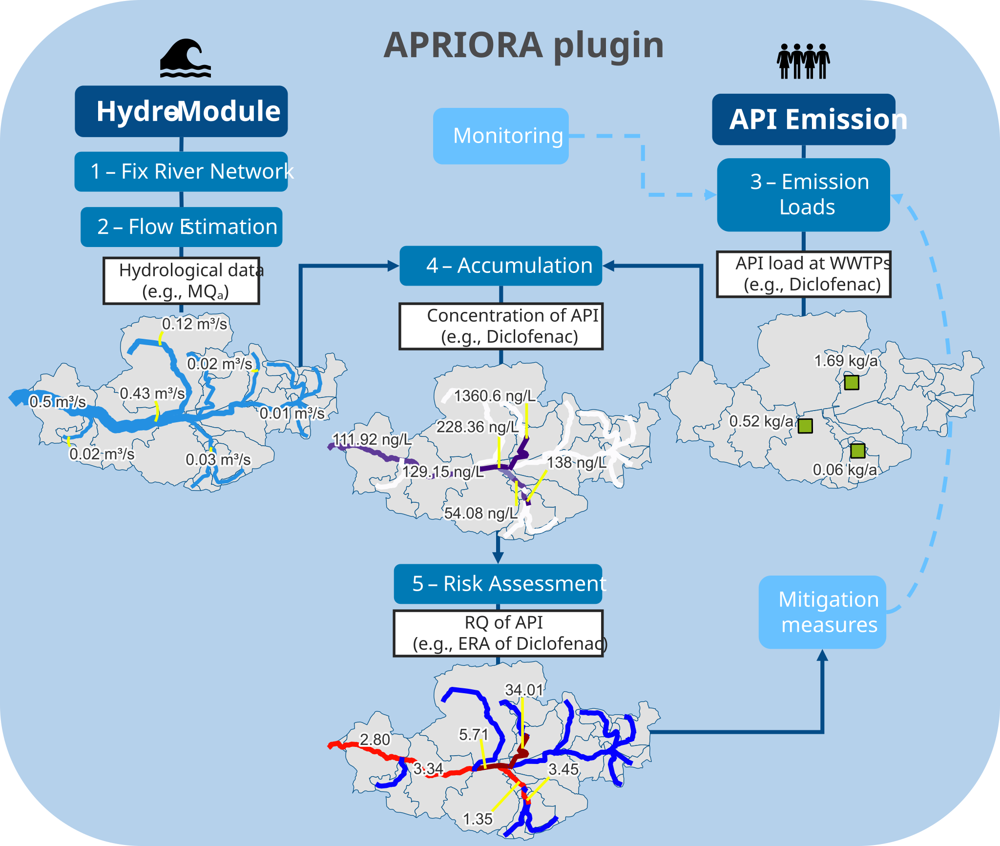

# Summary

`APRIORA` is an open-source QGIS plugin developed for spatial modelling and risk assessment of active pharmaceutical ingredients (APIs) in river basins. Designed to support regional authorities under the updated EU Urban Wastewater Treatment Directive (UWWTD), `APRIORA` offers a user-friendly, accessible workflow within the QGIS environment. The plugin is organized into two primary modules containing a total of five tools. The Hydro-Module pre-processes river networks and estimates key hydrological data in data-scarce catchments, while the API Emission module combines pharmaceutical statistics, connected inhabitants at the treatment plant and river hydrology to calculate predicted environmental concentrations (PECs) and risk quotients (RQs) for three different types of risk: environmental, antimicrobial resistance and human health. `APRIORA` allows users to customize emission parameters, plot comprehensive risk maps and simulate and compare the effectiveness of mitigation scenarios (e.g., treatment upgrades or discharge relocation). Tested in collaboration with regional stakeholders and applied across five Baltic Sea country pilots, `APRIORA` provides an accessible decision-support tool for water resource management.

# Statement of need

Pharmaceuticals are essential in modern healthcare. However, they can harm environmental components as they enter surface waters primarily through wastewater treatment plant (WWTP) effluents [@kosekImplementationAdvancedMicropollutants2020b]. Evidence of the detrimental effects of pharmaceuticals on non-target organisms at low concentrations [@daughtonPharmaceuticalsPersonalCare1999; @hoegerWaterborneDiclofenacAffects2005; @williamsNationalRiskAssessment2010], as well as their persistent presence in aquatic systems [@trancknerDemographicEffectsDomestic2010], has led to an intensified focus on API mitigation in European water management policy. Particularly, the updated EU Urban Wastewater Treatment Directive (UWWTD) mandates quaternary treatment upgrades for large WWTPs ($\geq$ 150.000 population equivalents (PE)) and requires risk-based prioritization for upgrading mid-sized facilities (10.000 to 150.000 PE) by 2030 based on discharge dilution and receiving water sensitivity [@EU_Directive_2024_3019].

While the UWWTD focuses primarily on medium and large infrastructure, small-sized WWTPs (< 10.000 PE) are frequently overlooked. However, small facilities discharging into tributaries or low-flow streams often create pollution hotspots due to critical mixing ratios between the emission load and receiving flow volume [@buttnerWhyWastewaterTreatment2022; @disabatinoResponsesFreshwaterInvertebrates2024]. At a catchment level, these distributed upstream discharges create localized ecotoxicological risks along individual river sections and substantial cumulative pollution loads reaching sensitive marine basins downstream, such as the Baltic Sea, which is one of the most polluted marine water bodies in the world [@reuschBalticSeaTime2018]. Risk characterization usually involves calculating risk quotients (RQs) by comparing predicted environmental concentrations (PECs) with predicted no-effect concentrations (PNECs) [@kisieliusProcessDesignRemoval2023] or legally more binding Environmental Quality Standards (EQSs), as updated under Directive 2026/80 [@Directive2026805].

To deal with the task of an informed and transparent risk assessment, environmental protection agencies (EPAs), regional and local authorities and WWTP operators require a unified, accessible methodology to model surface water API concentrations, assess spatially distributed risk and prioritize mitigation strategies within river catchments.

Although there are established exposure and emission models, such as stand-alone packages (MoRE [@fuchsModelingRegionalizedEmissions2017], ePiE [@oldenkampHighResolutionSpatialModel2018]), ArcGIS extensions (GREAT-ER [@kehreinModelingFateDownthedrain2015]) and complex research frameworks (STREAM-EU [@lindimLargescaleModelSimulating2016]), their practical adoption by regional decision-makers is affected by commercial software restrictions, high technical barriers to entry, unavailable input data, non-adaptable spatial domains and a lack of direct scenario testing capabilities. `APRIORA` fills this critical gap as a free and open-source QGIS plugin with low input data demands, allowing end-users to independently map RQs and evaluate interactive mitigation scenarios such as WWTP upgrades, effluent redirection, or discharge relocation.

# State of the field

To evaluate the water quality of river networks or catchments, several tools already exist, such as those cited previously: ePiE, STREAM-EU, GREAT-ER and MoRE offer distinct modelling capabilities, yet each presents operational challenges for regional applications. ePiE simulates first-order degradation kinetics and phase transport across European basins, but it relies on EU-wide reporting databases, automatically excluding small WWTPs (<2000 PE), leading to systematic exposure underestimation in upstream tributaries. Furthermore, the model is distributed as an R package, compromising its user-friendliness for authorities in charge who might not be skilled in R or basic coding. STREAM-EU provides dynamic, fugacity-based multi-media fate simulations, yet requires extensive physico-chemical and environmental parameterization that turns routine regional screening into a computationally heavy task. GREAT-ER computes reach-specific probabilistic concentration distributions via Monte Carlo simulations; however, it requires a commercial license for ArcGIS software and laborious data preparation for the catchment under investigation. Meanwhile, MoRE provides comprehensive multi-tier regionalized emission calculations, but it is a closed-distribution platform that requires direct coordination with its maintainers. Additionally, it aggregates pollutant loads over large spatial analytical units (>100 km2) rather than providing continuous, segment-by-segment river risk profiles.

A fundamental requirement across all these tools is accurate hydrological flow data to calculate in-river substance dilution and concentrations. Existing frameworks depend entirely on pre-defined external hydrological models or global databases (such as FLO1K for ePiE, LARSIM for MoRE or SWAT for GREAT-ER) limiting their adaptability in data-scarce areas, particularly in small, ungauged catchments where smaller WWTPs frequently discharge. Refactoring one of these existing models into a free and open-source QGIS plugin was technically unfeasible, making a standalone build the best option.

`APRIORA` provides its own hydrological module to estimate annual mean flow ($\text{MQ}_a$) and annual mean low flow ($\text{MLQ}_a$), while still keeping the possibility for users to import external hydrological datasets. Additionally, it provides an environment where users can freely customize input parameters including local API consumption, WWTP removal efficiencies, PNEC thresholds and monitoring data. Beyond standard environmental risk assessment (ERA), its framework also supports human health (HHRA) and antimicrobial resistance (AMR-RA) evaluations. It can also simulate environmental propagation for other micropollutants such as PFAS or microplastics whenever emission or consumption data are available. Finally, different mitigation scenario can be tested to support authorities in the decision-making process.

# Software design

The `APRIORA` plugin is an open-source QGIS extension designed to make pharmaceutical risk modelling easy to use for regional decision-makers and environmental agencies working under the UWWTD. Its main design goal is to provide a low technical barrier to entry by using mostly publicly available data and fitting directly into standard QGIS workflows. The plugin is organized into two main modules containing five total tools:
- Hydro-Module: preprocesses stream vector lines (*1 - Fix River Network*) and estimates $\text{MQ}_a$ and $\text{MLQ}_a$ in data-scarce catchments (*2 - Flow Estimation*)
- API Emission: calculates pollutant loads from WWTP (*3 - Emission Loads*), routes these loads downstream (*4 - Accumulation*) and perform risk assessment (*5 - Risk Assessment*)

A scheme of the plugin is illustrated in \autoref{fig:plugin_scheme}.

{width="80%"}

To make the tool useful across different regions, several practical trade-offs were built into the software design. First, the Hydro-Module works with standard European databases like Copernicus DEM, ERA5 precipitation and CORINE Land Cover, while still allowing users to use local data. Because precipitation data formats can differ between sources (such as ERA5 using single multi-year NetCDF files and local agencies like the German Weather Service using annual rasters), the interface includes a flexible toggle switch so users do not have to manually reformat their files.
Additionally, spatial data structures can vary country by country. While downstream routing usually relies on line networks, some databases (like Finland's Vemala model [@huttunenNationalScaleNutrientLoading2016]) store hydrological data as polygons. Because of this reason, *4 - Accumulation* and *5 - Risk Assessment* were designed to accept both linear river networks and polygon layers, letting users choose whichever spatial format fits best.

Finally, the plugin is characterised by high user customization. `APRIORA` comes pre-loaded with consumption data, removal rates and PNEC thresholds for ten common APIs across five Baltic Sea region countries. Users can easily update these parameters or even adjust them for the individual WWTPs within the study catchment. To simplify the collaboration between different users, these customized setups can be exported as simple tables and shared with colleagues, guaranteeing that everyone can reproduce the exact same model run without typing values in by hand.

# Research impact statement

Developed as part of the EU Interreg-sponsored [APRIORA project](https://interreg-baltic.eu/project/apriora/), the plugin was tested and refined based on direct feedback from project partners and environmental authorities. The tool was first introduced to the public in November 2025 at the EMPEREST final conference in Berlin, where around 20 regional stakeholders took part in a workshop on using the API Emission set of tools ([article](https://interreg-baltic.eu/project-posts/apriora/successful-apriora-stakeholder-workshop-in-berlin/)). A similar workshop was held in June 2026 in Rostock with about 15 regional stakeholders from the Mecklenburg-Western Pomerania region. In July 2026, the plugin was taught during the APRIORA One Health Summer School in Gdansk, where 50 participants were trained on using the tool ([article](https://ilc.enhanceuniversity.eu/opportunities/132)).

The research impact of `APRIORA` is shown through its application across five river catchments in Germany, Sweden, Finland, Latvia and Poland. Consortium partners used the plugin to model pharmaceutical risks and test local mitigation options under different conditions. These case studies formed the basis for pilot reports which can be found in the APRIORA project website ([Latvia](https://interreg-baltic.eu/project-pilots/piloting-in-latvia/), [Sweden](https://interreg-baltic.eu/project-pilots/piloting-in-sweden/), [Finland](https://interreg-baltic.eu/project-pilots/piloting-in-finland/), [Poland](https://interreg-baltic.eu/project-pilots/piloting-in-poland/) and [Germany](https://interreg-baltic.eu/project-pilots/piloting-in-germany/)). Additionally, a scientific paper about the development and application of the plugin is under writing.

# AI usage disclosure

Generative AI tools were used during the software development and paper writing process. AI was used to help write parts of the Python code, troubleshoot errors, and proofread the manuscript text. All AI-generated code was manually reviewed, tested, and verified by the developer through catchment modeling runs before the software was published. All the text was reviewed and edited by the authors to make sure it was factually correct.

# Acknowledgments

The project leading to this application is funded by the Interreg Baltic Sea Region Programme. Co-founded by the European Union (ERDF), this #MadeWithInterreg project helps to remove pollutants from our waters. The developer would also like to thank all the project partners, regional stakeholders and users who contributed to the development of the plugin by providing continuous feedback and ideas on how to improve it.

# References